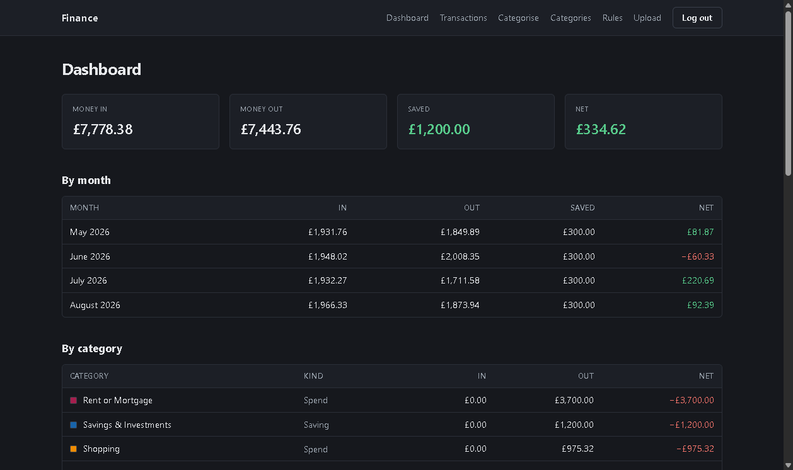
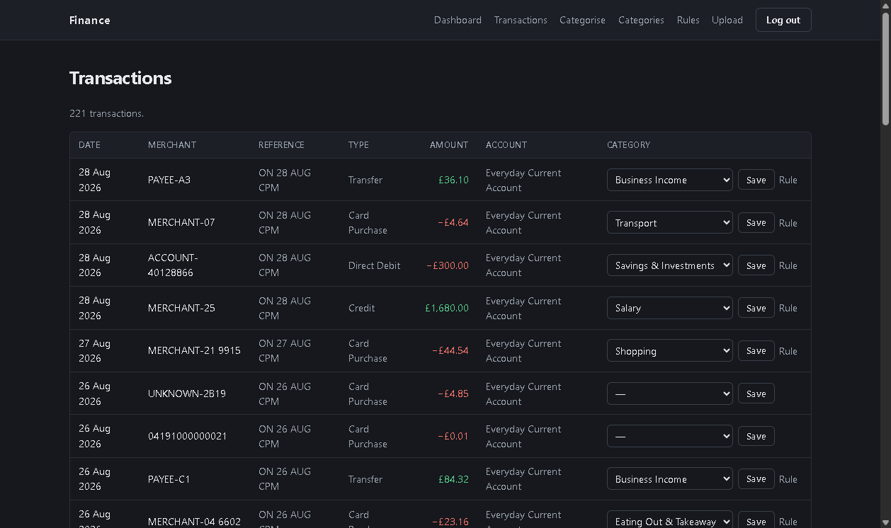
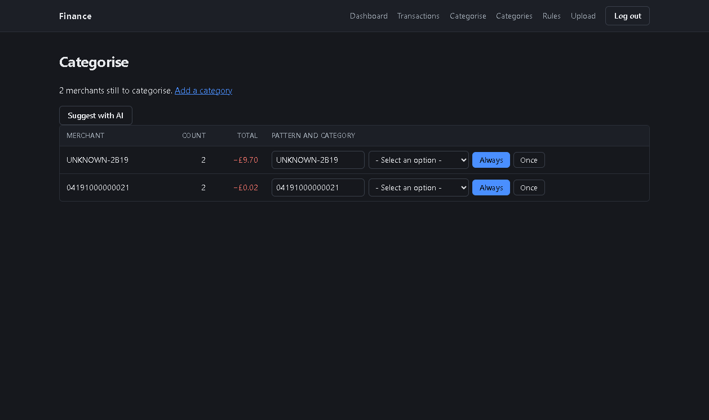
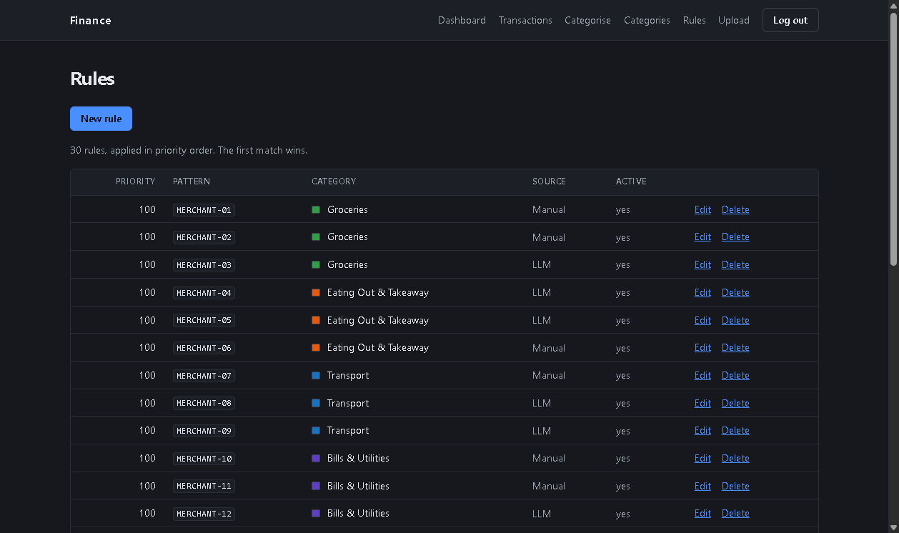

# Personal Finance Dashboard

**Live:** [web-production-117a.up.railway.app/transactions](https://web-production-117a.up.railway.app/transactions/) — log in with `demo` / `demo-password-123`.

A Django app that ingests UK bank statement CSVs, categorises the transactions,
and shows where the money actually goes.

Built because every free tool that syncs directly with a UK high-street bank
either shut down or moved behind a sales call — so this reads the statements you
can already download.

---

## Why uploads, not a bank connection

Live account access in the UK runs through Open Banking, and every route was
closed:

| Provider | Outcome |
| --- | --- |
| Enable Banking | 30 EEA countries, no UK coverage |
| GoCardless Bank Account Data | free tier closed to new signups |
| TrueLayer, Plaid | sales-gated, no self-serve tier |
| Stripe Financial Connections | US accounts only |

Uploading a CSV costs nothing and works with every bank that offers an export,
which is all of them. The tradeoff is that data arrives in batches rather than
continuously — acceptable for a tool you look at weekly.

---

## What it does

- **Imports** Barclays CSV statements, with a parser-per-format plugin layout
  for adding more banks
- **Categorises** transactions from per-user merchant rules, with an option to
  have an LLM propose new rules for merchants it has not seen
- **Reports** spending by month, by category and by merchant, with transfers and
  savings correctly kept out of the spending figures

---

## Screenshots

| Dashboard | Transactions |
| --- | --- |
|  |  |

| Categorise | Rules |
| --- | --- |
|  |  |

Populated from `manage.py seed_demo`, not real transaction data.

---

## Three things worth reading the code for

### Imports are idempotent, without bank transaction IDs

Bank CSVs carry no stable identifier, so re-uploading an overlapping statement
would ordinarily duplicate everything. Each row gets a SHA-256 fingerprint of
its date, amount, raw description **and an occurrence index** — so two genuinely
separate £3.20 coffees on the same day survive as two rows, while re-importing
the same file inserts nothing.

The fingerprint hashes the raw bank memo rather than the parsed merchant name,
so improving merchant extraction later never invalidates existing fingerprints.

Import is also all-or-nothing: one uninterpretable row fails the whole upload.
A partial import would leave the dashboard quietly under-reporting, which is
worse than a visible failure.

`transactions/importer.py`

### Categories have a kind, because not all money out is spending

Moving £500 to a savings account is not spending, and neither is settling up
with a friend. Every category carries a kind — `SPEND`, `INCOME`, `TRANSFER` or
`SAVING` — and the aggregates use it.

On real data this mattered more than expected: the dashboard had been
overstating spending by £2,404 and income by £1,806, reporting a net of −£143.89
when the true figure was +£454.81.

The filters **exclude** non-spend kinds rather than selecting `SPEND`, so a
transaction with no category at all still counts as spending. Missing money is a
worse failure than a wrong label.

`transactions/stats.py`

### The LLM proposes rules, and a human accepts them

Rather than classifying each transaction, one request sends the unrecognised
merchant names and the user's own category names, and gets back proposed
merchant → category rules.

- The JSON schema constrains `category` to an **enum of that user's existing
  category names**, so an invented category cannot be generated
- Responses are validated again on arrival — a suggested pattern that is not a
  substring of its merchant is discarded, because the rule would never fire
- Nothing is written automatically. Suggestions pre-fill the form, and
  `CategoryRule.source` records whether a saved rule was accepted as suggested
  or edited first

One call covers a whole backlog, which costs a fraction of a penny.

`transactions/suggester.py`

---

## Running it

Requires Python 3.12, [uv](https://docs.astral.sh/uv/) and Docker.

```bash
uv sync
cp .env.example .env     # then fill it in
docker compose up -d     # PostgreSQL 17
uv run manage.py migrate
uv run manage.py createsuperuser
uv run manage.py runserver
```

`OPENAI_API_KEY` is only needed for rule suggestions — everything else works
without it.

Sample statement data for trying the import lives in
`transactions/sample_data/`.

---

## Tests

```bash
uv run pytest
```

138 tests covering the parsers, the importer, the aggregates, the rule
suggestions and the views.

The aggregate and rule tests have been checked by mutation — deliberately
breaking the kind exclusion, the rule re-application and the per-user scoping
each fails a handful of them.

---

## Layout

```
config/                     settings, root urls
accounts/                   custom user model
transactions/
├── parsers/
│   ├── base.py             ABC, ParseResult, ParsedTransaction
│   ├── registry.py         header-signature detection
│   └── barclays.py         Barclays CSV
├── importer.py             fingerprinting, idempotent import
├── categoriser.py          rule matching, recategorise
├── suggester.py            OpenAI rule suggestions
├── stats.py                dashboard aggregates
├── models.py               Account, Transaction, Category, CategoryRule
├── views.py                function views plus category and rule CRUD
├── migrations/             nine, two of them hand-written backfills
└── tests/                  138 tests
templates/                  base and login
```

`categoriser.py` and `stats.py` deliberately contain no I/O, which is why they
are the easiest parts of the project to test. `suggester.py` is the only module
that talks to the OpenAI API.

---

## Not built, on purpose

- **Live bank sync** — see above
- **PDF statements** — CSV is available from every UK bank and is far less
  fragile to parse
- **Budgets and forecasting** — this answers where the money went, not where it
  should go
